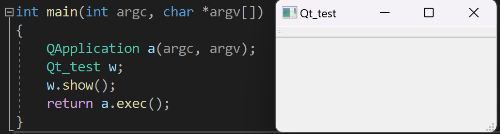
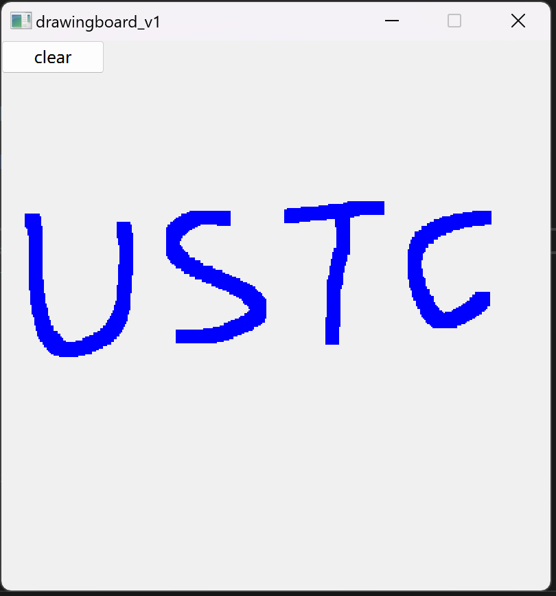
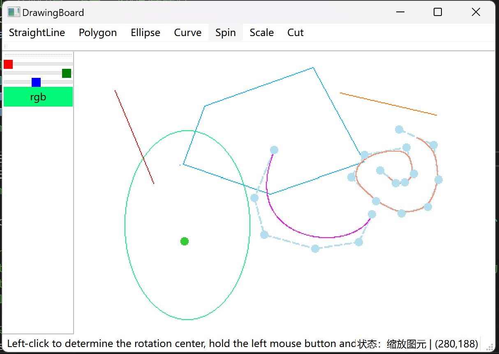
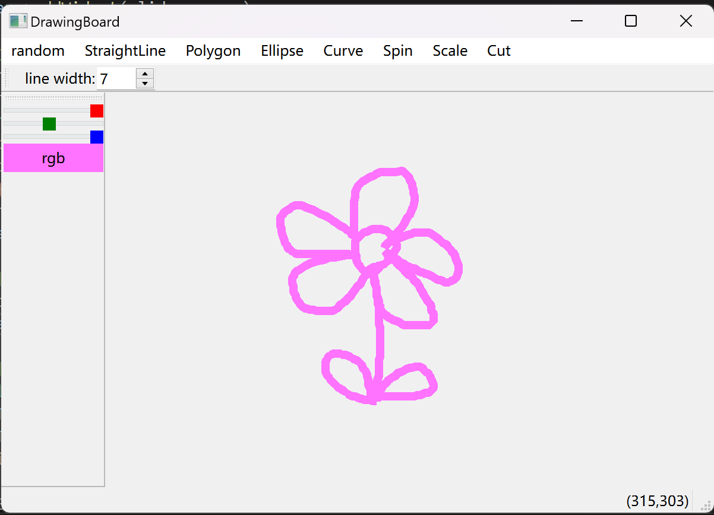
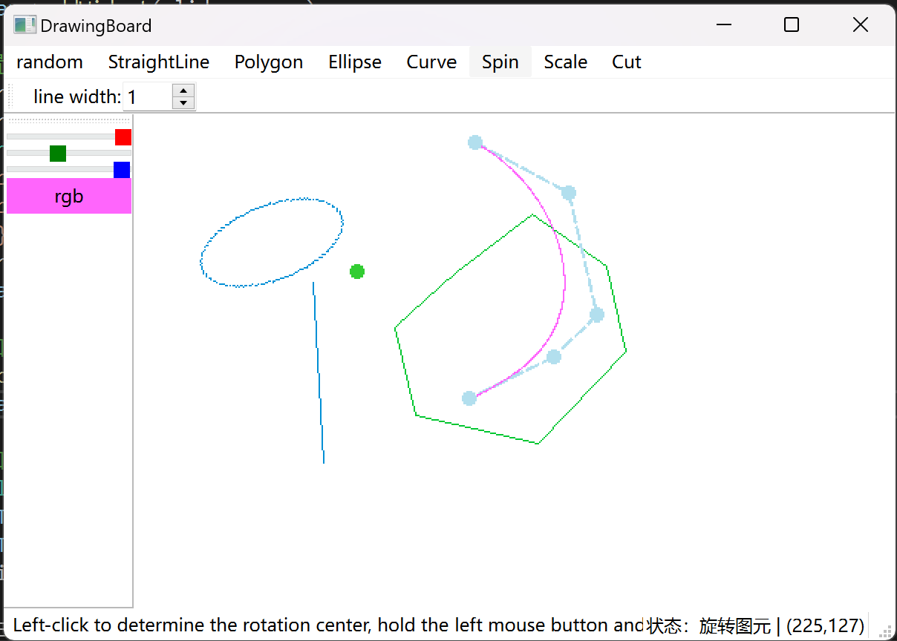

# Introduction
This project implements **a simple drawing board**, which is an improvement upon the "https://github.com/NJU-TJL/CG_Painter.git" project. Building upon the foundation of that project, additional features such as freehand drawing, color picker, and brush size settings have been added.
# Env
Visual Studio: version 2022

Qt: version 6.4.3
# reference
https://github.com/NJU-TJL/CG_Painter.git

Docs/Qt-6.4.3/qtdoc/classes.html (In the installation directory)

# Showcase
## Qt test env
a simple program written to verify if the Qt library is installed correctly

  

## version 1.0
Showcase a simple window where users can freely draw using a fixed color and pen width. (The purpose is to familiarize myself with basic operations of Qt and lay the foundation for future versions.)

  

## version 2.0
Based on CG_Painter, a color palette control has been added. There are three sliders in the toolbox representing the values of red (R), green (G), and blue (B) colors, ranging from 0 to 255. You can adjust the sliders to configure the color. After that, you can click the button below the sliders labeled 'rgb', and the background color of the button will change to the color you have selected. You can then use this color for drawing.

## version 3.0
In addition, a separate canvas has been created specifically for freehand drawing. On this canvas, you can freely adjust the brush size and color for drawing. This canvas operates and records independently from the one showcased in v2.

  
  

